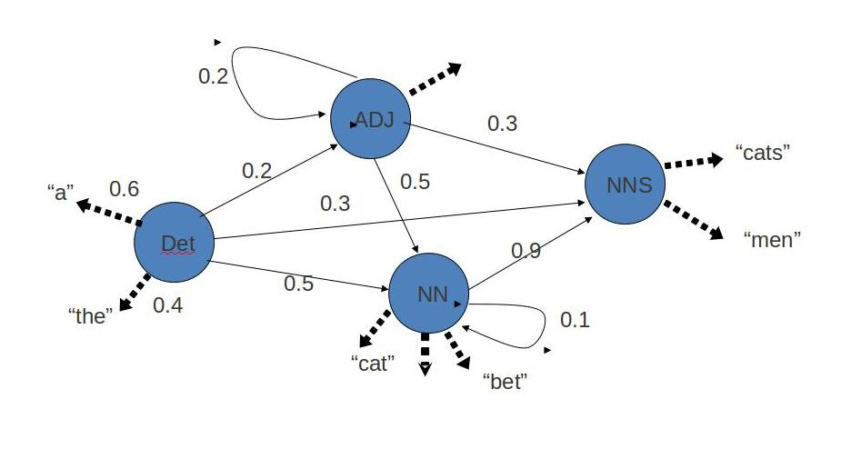

POS tagging or part-of-speech tagging is the procedure of assigning a grammatical category like noun, verb, adjective etc. to a word. In this process both the lexical information and the context play an important role as the same lexical form can behave differently in a different context.

For example the word "Park" can have two different lexical categories based on the context.
- The boy is playing in the park. ('Park' is Noun)
- Park the car. ('Park' is Verb)

Assigning part of speech to words by hand is a common exercise one can find in an elementary grammar class. But here we wish to build an automated tool which can assign the appropriate part-of-speech tag to the words of a given sentence. One can think of creating hand crafted rules by observing patterns in the language, but this would limit the system's performance to the quality and number of patterns identified by the rule crafter. Thus, this approach is not practically adopted for building POS Tagger. Instead, a large corpus annotated with correct POS tags for each word is given to the computer and algorithms then learn the patterns automatically from the data and store them in form of a trained model. Later this model can be used to POS tag new sentences.

In this experiment we will explore how such a model can be learned from the data.

### Objective

The objective of the experiment is to calculate emission and transition matrix which will be helpful for tagging Parts of Speech using Hidden Markov Model.