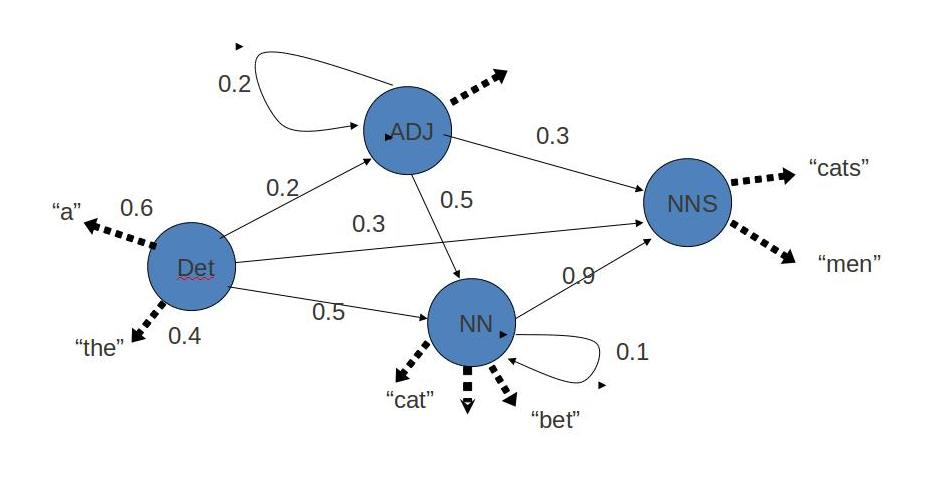

### What is POS Tagging?

Part-of-Speech (POS) tagging is the process of assigning a grammatical category (such as noun, verb, adjective, etc.) to each word in a sentence. POS tagging is a foundational task in Natural Language Processing (NLP) because it helps computers understand the structure and meaning of text, enabling downstream applications like parsing, information extraction, and machine translation.

### Why is POS Tagging Important?

Words can have different meanings and grammatical roles depending on their context. For example, the word "can" in "I can swim" (verb) vs. "a can of beans" (noun). POS tagging helps disambiguate such cases by considering both the word and its surrounding context.

### Algorithms for POS Tagging

#### Hidden Markov Model (HMM)

HMMs are probabilistic models that assign POS tags by considering the likelihood of a tag sequence given the observed words. They use statistics from a labeled corpus to estimate the probability of a tag following another tag (context) and the probability of a word being associated with a tag. HMMs can use bigram (one neighbor) or trigram (two neighbors) context to improve accuracy. More advanced HMMs can learn the probabilities of longer sequences, allowing them to capture more complex patterns in language.

*Figure: An example of a Hidden Markov Model (HMM) for POS tagging. Each circle represents a possible part-of-speech tag (e.g., Det, ADJ, NN, NNS). Solid arrows show the probabilities of transitioning from one tag to another (e.g., Det → NN), while dashed arrows show the probabilities of a tag emitting a particular word (e.g., Det emits "the" or "a"). The model uses these probabilities to find the most likely sequence of tags for a given sentence.*

#### Conditional Random Field (CRF)

CRFs are a class of statistical modeling methods often applied in machine learning for structured prediction. Unlike HMMs, which make certain independence assumptions, CRFs can take into account a wider range of contextual features and dependencies. This makes them particularly effective for tasks like POS tagging, where the context of a word (its neighbors and other features) is crucial for accurate prediction. CRFs can use bigram, trigram, or even more complex features to improve tagging performance.

### Role of Context and Corpus Size

- **Context (Bigram/Trigram):** Using information from neighboring words (bigram/trigram) helps the model make better predictions, especially for ambiguous words.
- **Corpus Size:** Larger training corpora provide more examples, allowing the model to learn more accurate probabilities and improve tagging performance.

Building a POS tagger involves selecting appropriate algorithms (such as HMM or CRF), choosing relevant features (like context windows), and training on a sufficiently large and representative corpus. The effectiveness of a POS tagger depends on how well it can use context to resolve ambiguities and how much data it has seen during training. Modern POS taggers leverage both statistical models and rich contextual features to achieve high accuracy, making them essential tools in the field of Natural Language Processing.

